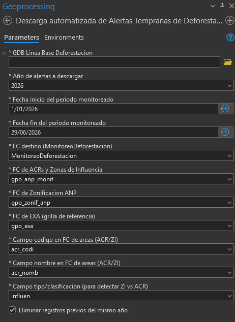
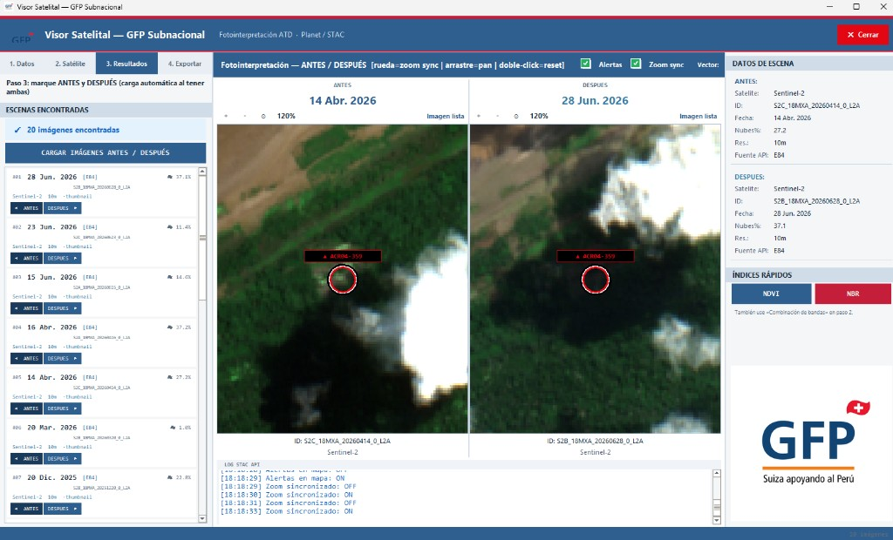
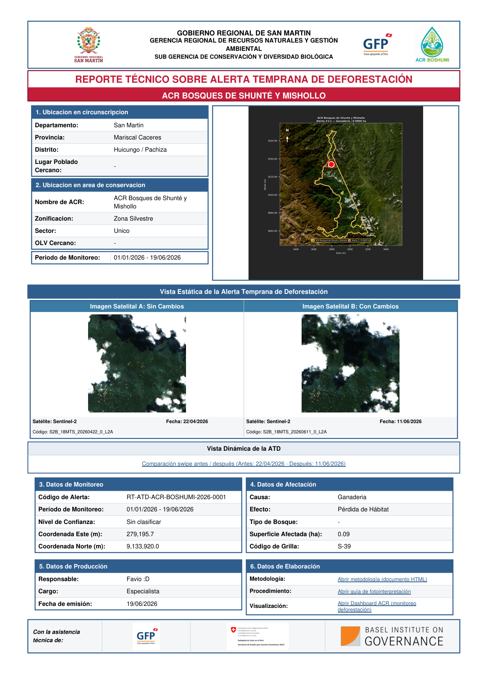
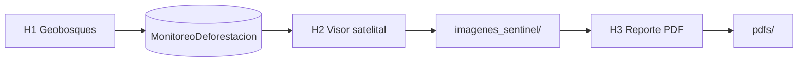

  
  &nbsp;&nbsp;&nbsp;&nbsp;
  
  &nbsp;&nbsp;&nbsp;&nbsp;
  

<h1 align="center">ATD Toolbox ACR — Loreto, San Martín y Cusco</h1>

  <strong>Caja de herramientas de Alertas Tempranas de Deforestación para Áreas de Conservación Regional</strong> 
  <em>GFP Subnacional · Suiza apoyando al Perú</em>

  <a href="https://gfp-subnacional-peru.github.io/ATD-Toolbox-ACR/docs/GUIA_VISUAL.html"><strong>Abrir guía visual completa (capturas H1 · H2 · H3)</strong></a> 
  <a href="https://gfp-subnacional-peru.github.io/ATD-Toolbox-ACR/INDICE.html">Índice HTML</a> ·
  <a href="INDICE.html">Índice local</a>

  <a href="#para-quién-es">Para quién es</a> ·
  <a href="#cómo-trabajar-en-3-pasos">Cómo trabajar</a> ·
  <a href="#demo-5-minutos">Demo 5 minutos</a> ·
  <a href="#las-tres-regiones">Las 3 regiones</a> ·
  <a href="#inicio-rápido">Inicio rápido</a>

---

## Para quién es

Para el **personal de las ACR** y equipos de monitoreo de Loreto, San Martín y Cusco.  
No necesita ser programador: solo **ArcGIS Pro 3.x** y seguir la guía de **su** región.

---

## Cómo trabajar en 3 pasos

1. **Descargar alertas** desde Geobosques (H1)  
2. **Fotointerpretar** en el visor satelital y actualizar hectáreas (H2)  
3. Generar el **informe PDF oficial** (H3)

| Paso | Herramienta | Qué hace |
|:----:|-------------|----------|
| **1** | **H1 — Descarga Geobosques** | Inserta alertas en la geodatabase de su región |
| **2** | **H2 — Visor + Actualizar Superficie** | Antes/después, recorte del polígono y hectáreas |
| **3** | **H3 — Reporte PDF** | Informe técnico con mapa, imágenes y logos institucionales |

  <strong>Geobosques → H1 → H2 → H3 → PDF en <code>pdfs/</code></strong>

### Vista rápida del flujo (capturas reales)

  

<em>H1 — Descarga e inserción de alertas Geobosques</em>

  

<em>H2 — Visor satelital (antes / después)</em>

  

<em>H3 — Reporte PDF institucional (mismo formato en las 3 regiones)</em>

---

## Demo 5 minutos

Prueba rápida **sin Geobosques** — ideal para taller o exposición. El flujo es **igual** en las tres regiones; solo cambia la carpeta.

| Paso | Acción | Qué deberías ver |
|:----:|--------|------------------|
| 1 | Abrir **solo** `regiones/ATD_<Region>/` en ArcGIS Pro | Carpeta regional intacta |
| 2 | **Catalog → Add Toolbox** → H1, H2 y H3 en `toolbox/` | Las 3 herramientas en geoprocesamiento |
| 3 | Agregar al mapa `GDB/…` → `MonitoreoDeforestacion` | Alertas en el mapa |
| 4 | **H2** → seleccionar **1 polígono** → buscar escenas ANTES/DESPUÉS | Visor satelital GFP |
| 5 | **H3** → Diagnóstico Pre-Vuelo → Generar Reporte ATD (1 alerta) | PDF en `pdfs/` |
| 6 | Comparar con el PDF de ejemplo de **su** región en `docs/` | Mismo formato institucional |

> En el demo corto puede saltar **H1** si la GDB ya tiene alertas. Cada región trae su propio PDF de ejemplo en `docs/` (no hay un “caso único” nacional).

---

## Las tres regiones

| Región | ACR | Carpeta | Guía | PDF ejemplo |
|--------|-----|---------|------|-------------|
| **Loreto** | CTT, Ampiyacu, Alto Nanay, Maijuna, MPA, ACM | [`regiones/ATD_Loreto/`](regiones/ATD_Loreto/) | [Guía](regiones/ATD_Loreto/guia/GUIA_ATD_LORETO.html) | [PDF](regiones/ATD_Loreto/docs/EJEMPLO_reporte_ATD_Loreto.pdf) |
| **San Martín** | Cordillera Escalera (CE), BOSHUMI | [`regiones/ATD_San_Martin/`](regiones/ATD_San_Martin/) | [Guía](regiones/ATD_San_Martin/guia/GUIA_ATD_SAN_MARTIN.html) | [PDF](regiones/ATD_San_Martin/docs/EJEMPLO_reporte_ATD_San_Martin.pdf) |
| **Cusco** | Choquequirao, Chuyapi Urusayhua, Q'eros Kosñipata | [`regiones/ATD_Cuzco/`](regiones/ATD_Cuzco/) | [Guía](regiones/ATD_Cuzco/guia/GUIA_ATD_CUZCO.html) | [PDF](regiones/ATD_Cuzco/docs/EJEMPLO_reporte_ATD_Cuzco.pdf) |

Las tres regiones tienen **toolbox H1–H2–H3** (mismos arreglos 2026), GDB, logos y guía. **No mezclar** GDB ni logos entre GORE.

---

## Inicio rápido

1. Entrar a [`INDICE.html`](INDICE.html) y elegir **su región**.
2. Clonar o descargar el repo y abrir **solo** `regiones/ATD_<Region>/` en ArcGIS Pro.
3. **Catalog → Add Toolbox** → H1, H2 y H3 en `toolbox/`.
4. Ejecutar `DIAGNOSTICO_ENTORNO.bat` la primera vez.
5. Seguir la guía HTML de su región o el [demo 5 minutos](#demo-5-minutos).

**Descarga:** el paquete completo pesa ~2,9 GB (geodatabases con Git LFS). Para un taller, puede copiar solo la carpeta de una región por USB.

---

## Paquetes relacionados

| Recurso | Uso |
|---------|-----|
| Este repo | Las 3 regiones juntas |
| [ATD-Loreto-GFP](https://github.com/Favio138-hub/ATD-Loreto-GFP) | Solo Loreto (repo ligero) |

---

## Créditos

**GFP Subnacional** · Cooperación Suiza (SECO) · Basel Institute on Governance  
GORE Loreto · GORE San Martín · GORE Cusco

Versión 2026 · Uso institucional ATD ACR
